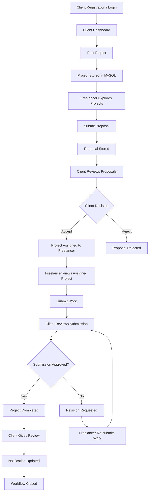
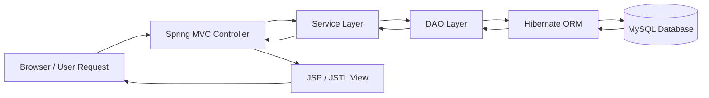
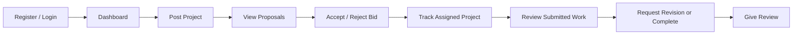
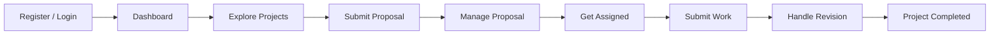

<div align="center">


<br/>


<br/>
<br/>


<br/>
<br/>

<a href="https://github.com/harshmagar23/WorkSphere/actions/workflows/maven-build.yml">
  
</a>

<br/>
<br/>


<br/>
<br/>


<br/>

<h3>A complete Java-based freelance marketplace where clients post projects, freelancers submit proposals, work gets assigned, submitted, revised, completed, reviewed, and tracked through a real workflow.</h3>

</div>

---

# WorkSphere

**WorkSphere** is a full-stack freelance marketplace web application designed to connect **clients** and **freelancers** through a complete project lifecycle.

Unlike a basic CRUD project, WorkSphere focuses on a real marketplace journey:

```text
Client Registration
        ↓
Project Posting
        ↓
Freelancer Proposal
        ↓
Bid Accept / Reject
        ↓
Project Assignment
        ↓
Work Submission
        ↓
Client Review
        ↓
Revision or Completion
        ↓
Final Review
        ↓
Marketplace Workflow Closed
```

The project is inspired by platforms like **Fiverr**, **Upwork**, and **Freelancer**, but it is built using a traditional Java full-stack web development stack: **Spring MVC, Hibernate, JSP, JSTL, MySQL, Maven, and Apache Tomcat**.

---

<div align="center">

## Project Identity

| Field | Details |
|---|---|
| **Project Name** | WorkSphere |
| **Project Type** | Full Stack Java Web Application |
| **Domain** | Freelance Marketplace |
| **Primary Users** | Client and Freelancer |
| **Backend Stack** | Java, Spring MVC, Hibernate |
| **Frontend Stack** | JSP, JSTL, HTML5, CSS3, Bootstrap, JavaScript |
| **Database** | MySQL |
| **Build Tool** | Maven |
| **Server** | Apache Tomcat 9 |
| **Architecture** | MVC Architecture |
| **Packaging** | WAR |
| **IDE Used** | Eclipse IDE |
| **Project Status** | Functional and Portfolio Ready |
| **License** | All Rights Reserved / Demo Only |

</div>

---

## Table of Contents

- [Project Vision](#project-vision)
- [What Makes WorkSphere Different](#what-makes-worksphere-different)
- [Project Identity](#project-identity)
- [Complete Marketplace Workflow](#complete-marketplace-workflow)
- [Marketplace Flow Diagram](#marketplace-flow-diagram)
- [Role-Based Capability Matrix](#role-based-capability-matrix)
- [Feature Galaxy](#feature-galaxy)
- [Client Features](#client-features)
- [Freelancer Features](#freelancer-features)
- [System Features](#system-features)
- [Technology Stack](#technology-stack)
- [System Architecture](#system-architecture)
- [Project Modules](#project-modules)
- [Important Pages](#important-pages)
- [Common Application Routes](#common-application-routes)
- [Project Structure](#project-structure)
- [Database Setup](#database-setup)
- [Local Setup Guide](#local-setup-guide)
- [Maven Build](#maven-build)
- [Manual Testing Flow](#manual-testing-flow)
- [Demo Scenario](#demo-scenario)
- [Current Project Status](#current-project-status)
- [Repository Quality](#repository-quality)
- [UI / UX Direction](#ui--ux-direction)
- [Security Notes](#security-notes)
- [Deployment Notes](#deployment-notes)
- [Screenshots](#screenshots)
- [Roadmap](#roadmap)
- [Known Limitations](#known-limitations)
- [Learning Outcomes](#learning-outcomes)
- [Interview Talking Points](#interview-talking-points)
- [Author](#author)
- [Repository](#repository)
- [License](#license)

---

## Project Vision

The goal of **WorkSphere** is to demonstrate how a real freelance marketplace works behind the scenes.

A client does not simply create a project and stop there. A real platform needs:

```text
User roles
Authentication
Project posting
Proposal management
Bid decisions
Assignment logic
Work delivery
Revision handling
Completion flow
Review system
Notifications
Error handling
Repository documentation
Deployment readiness
```

WorkSphere brings these operations into one connected Java web application.

---

## What Makes WorkSphere Different

<div align="center">


</div>

| Point | Why It Matters |
|---|---|
| **Workflow-driven project** | Every action changes the project journey instead of working as isolated CRUD screens |
| **Two real user roles** | Client and freelancer have separate responsibilities, dashboards, actions, and views |
| **Proposal-based hiring** | Freelancers submit bids and clients make accept/reject decisions |
| **Assignment logic** | Accepted proposal connects the freelancer with the project |
| **Submission and revision flow** | Work can be submitted, reviewed, revised, and completed |
| **Review system** | The project ends with feedback, similar to real freelance platforms |
| **Professional JSP UI** | The application is designed as a complete platform, not just plain academic pages |
| **Custom error pages** | Default Tomcat error screens are replaced with branded WorkSphere error pages |
| **Portfolio-ready README** | The repository explains setup, features, architecture, testing, and project value clearly |

---

## Complete Marketplace Workflow

```text
01. Client registers or logs in
02. Client posts a new project
03. Freelancer registers or logs in
04. Freelancer explores available projects
05. Freelancer submits a proposal
06. Freelancer can edit or withdraw proposal
07. Client views all proposals for posted projects
08. Client accepts or rejects freelancer bids
09. Accepted freelancer gets assigned to the project
10. Freelancer views assigned project
11. Freelancer submits completed work with message/file
12. Client reviews submitted work
13. Client requests revision or completes the project
14. Freelancer re-submits revised work if revision is requested
15. Client marks project as completed
16. Client gives freelancer a final review
17. Notifications keep users updated
18. Workflow closes professionally
```

---

## Marketplace Flow Diagram



---

## MVC Architecture Diagram



---

## Role-Based Capability Matrix

| Capability | Client | Freelancer | System |
|---|---:|---:|---:|
| Register account | Yes | Yes | Stores user data |
| Login account | Yes | Yes | Session handling |
| Dashboard access | Yes | Yes | Role-based navigation |
| Post project | Yes | No | Project persistence |
| Edit project | Yes | No | Project update |
| Cancel project | Yes | No | Project status update |
| Explore projects | No | Yes | Project listing |
| Submit proposal | No | Yes | Bid/proposal storage |
| Edit proposal | No | Yes | Proposal update |
| Withdraw proposal | No | Yes | Proposal status update |
| View proposals | Yes | No | Proposal listing |
| Accept bid | Yes | No | Assignment creation |
| Reject bid | Yes | No | Proposal status update |
| Track assigned project | Yes | Yes | Shared project state |
| Submit work | No | Yes | Work submission handling |
| Upload work file | No | Yes | Multipart file support |
| Request revision | Yes | No | Status transition |
| Re-submit revised work | No | Yes | Revision workflow |
| Complete project | Yes | No | Completion state |
| Give review | Yes | Freelancer receives | Feedback storage |
| View notifications | Yes | Yes | Workflow updates |
| Use custom error pages | Yes | Yes | Branded error handling |
| Mock payment center | Yes | Related to workflow | Demo payment flow |

---

## Feature Galaxy

<div align="center">


<br/>
<br/>


</div>

---

## Client Features

```text
Client registration
Client login
Client dashboard
Post new project
View posted projects
Edit project details
Cancel project
View freelancer proposals
Accept freelancer bids
Reject freelancer bids
Track assigned projects
View submitted work
Request revisions
Complete projects
Give freelancer reviews
View client notifications
Access mock escrow / payment center
Navigate through custom error pages
```

### Client Journey



---

## Freelancer Features

```text
Freelancer registration
Freelancer login
Freelancer dashboard
Explore available projects
Submit proposals
View submitted proposals
Edit proposals
Withdraw proposals
Track proposal status
View assigned projects
Submit completed work
Upload work file
Re-submit work after revision request
View freelancer notifications
Track project progress
Receive client reviews
```

### Freelancer Journey



---

## System Features

```text
Role-based authentication
Session-based user flow
Spring MVC controller routing
Hibernate-based database operations
JSP and JSTL dynamic page rendering
Project lifecycle management
Proposal and bid workflow
Assigned project tracking
Work submission workflow
File upload support
Revision request workflow
Review and feedback system
Client notification page
Freelancer notification page
Mock payment / escrow flow
Custom 404 page
Custom 403 page
Custom 500 page
Maven WAR packaging
Tomcat deployment support
Professional repository documentation
```

---

## Technology Stack

<div align="center">

| Layer | Technology |
|---|---|
| **Programming Language** | Java |
| **Backend Framework** | Spring MVC |
| **ORM Framework** | Hibernate |
| **View Layer** | JSP, JSTL |
| **Frontend** | HTML5, CSS3, Bootstrap, JavaScript |
| **Database** | MySQL |
| **Build Tool** | Maven |
| **Server** | Apache Tomcat 9 |
| **IDE** | Eclipse IDE |
| **Packaging** | WAR |
| **Architecture** | MVC |

<br/>


</div>

---

## System Architecture

WorkSphere follows the **Model-View-Controller** architecture.

```text
User Browser
   ↓
Spring MVC Controller
   ↓
Service Layer
   ↓
DAO Layer
   ↓
Hibernate ORM
   ↓
MySQL Database
   ↓
JSP / JSTL Response
```

### Architecture Responsibility Map

| Layer | Responsibility |
|---|---|
| **Controller** | Handles HTTP requests, routing, validation flow, redirects, and model attributes |
| **Service** | Handles business rules and workflow coordination |
| **DAO** | Handles database access and persistence logic |
| **Model** | Represents Hibernate entity classes |
| **View** | JSP pages render dynamic data using JSTL and request/session attributes |
| **Database** | Stores users, projects, proposals, submissions, reviews, notifications, and workflow data |

---

## Project Modules

<details>
<summary><strong>Authentication Module</strong></summary>

Handles login, registration, logout, session management, validation messages, and role-based navigation.

```text
Client registration
Freelancer registration
Client login
Freelancer login
Logout flow
Session handling
Invalid credential handling
Successful login message
Successful registration message
Role-based dashboard redirection
```

</details>

<details>
<summary><strong>Client Module</strong></summary>

Handles client-side marketplace operations.

```text
Client dashboard
Post project
View posted projects
Edit project
Cancel project
View freelancer proposals
Accept proposal
Reject proposal
View assigned projects
Review submitted work
Request revision
Complete project
Give review
Client notifications
Payment center / mock escrow flow
```

</details>

<details>
<summary><strong>Freelancer Module</strong></summary>

Handles freelancer-side marketplace operations.

```text
Freelancer dashboard
Explore available projects
Submit proposal
View submitted proposals
Edit proposal
Withdraw proposal
View assigned projects
Submit completed work
Upload files
Re-submit work after revision
Freelancer notifications
Track proposal/project status
```

</details>

<details>
<summary><strong>Project Module</strong></summary>

Handles project lifecycle operations.

```text
Create project
Update project
Cancel project
View project details
Track project status
Connect projects with clients
Connect projects with accepted freelancers
Connect projects with proposals
Connect projects with submissions and reviews
```

</details>

<details>
<summary><strong>Proposal and Bid Module</strong></summary>

Handles freelancer proposals and client decisions.

```text
Submit proposal
Edit proposal
Withdraw proposal
View proposal status
Accept proposal
Reject proposal
Update proposal status
Create assigned project after acceptance
Prevent inconsistent proposal states
```

</details>

<details>
<summary><strong>Work Submission Module</strong></summary>

Handles work delivery and revision.

```text
Submit work
Upload work file
Add submission message
Client reviews submission
Client requests revision
Freelancer re-submits work
Client completes project
```

</details>

<details>
<summary><strong>Review Module</strong></summary>

Handles feedback after successful completion.

```text
Give review
Store review
Connect review with freelancer
Connect review with project
Display review data
Improve marketplace trust signal
```

</details>

<details>
<summary><strong>Notification Module</strong></summary>

Handles user workflow updates.

```text
Client notifications
Freelancer notifications
Bid status updates
Project assignment updates
Revision request updates
Completion updates
Review updates
```

</details>

<details>
<summary><strong>Payment / Mock Escrow Module</strong></summary>

Demonstrates a payment center style workflow.

```text
Mock payment flow
Project payment context
Escrow-style project payment simulation
Portfolio-level marketplace realism
```

</details>

<details>
<summary><strong>Error Handling Module</strong></summary>

Provides branded error screens instead of default Tomcat pages.

```text
Custom 404 Page Not Found
Custom 403 Forbidden
Custom 500 Internal Server Error
Professional platform messaging
Safe navigation options
Role-friendly recovery links
```

</details>

---

## Important Pages

```text
Landing Page
Client Login Page
Client Registration Page
Freelancer Login Page
Freelancer Registration Page
Client Dashboard
Freelancer Dashboard
Post Project Page
View My Projects Page
Explore Projects Page
Submit Proposal Page
My Proposals Page
Assigned Projects Page
Submit Work Page
Review Page
Client Notifications Page
Freelancer Notifications Page
Payment / Escrow Page
Custom 404 Error Page
Custom 403 Error Page
Custom 500 Error Page
```

---

## Common Application Routes

> Route names can vary based on controller configuration, but these are the common WorkSphere routes used across the application.

| Route / Page | Purpose |
|---|---|
| `/WorkSphere/` | Landing page |
| `/clientLogin` | Client login |
| `/freelancerLogin` | Freelancer login |
| `/clientDashboard` | Client dashboard |
| `/freelancerDashboard` | Freelancer dashboard |
| `/postProjectPage` | Client project posting page |
| `/viewMyProjects` | Client posted projects |
| `/viewAllProjects` | Freelancer project exploration |
| `/myProposals` | Freelancer submitted proposals |
| `/clientNotifications` | Client notification page |
| `/freelancerNotifications` | Freelancer notification page |

---

## Project Structure

```text
WorkSphere/
│
├── README.md
│
└── WorkSphere/
    │
    ├── pom.xml
    ├── .gitignore
    │
    └── src/
        └── main/
            │
            ├── java/
            │   └── com/
            │       │
            │       ├── controller/
            │       │   └── Spring MVC Controllers
            │       │
            │       ├── dao/
            │       │   └── Database Access Layer
            │       │
            │       ├── model/
            │       │   └── Hibernate Entity Classes
            │       │
            │       └── service/
            │           └── Business Logic Layer
            │
            └── webapp/
                │
                ├── WEB-INF/
                │   │
                │   ├── View/
                │   │   └── JSP Pages
                │   │
                │   ├── web.xml
                │   └── spring-servlet.xml
                │
                └── Static Web Resources
```

---

## Example Core Entity

A simplified project entity can include fields such as:

```text
Project ID
Project title
Project description
Budget
Deadline
Status
Submission message
Submission date
Submission files
Client reference
Assigned freelancer reference
```

This allows the project to move through different marketplace states:

```text
Open
Proposal Submitted
Assigned
Work Submitted
Revision Requested
Re-submitted
Completed
Cancelled
```

---

## Database Setup

WorkSphere uses **MySQL** as the database.

Default database name:

```sql
CREATE DATABASE freelance_portal;
```

Database configuration file:

```text
WorkSphere/src/main/webapp/WEB-INF/spring-servlet.xml
```

Example database configuration:

```xml
<property name="url" value="jdbc:mysql://localhost:3306/freelance_portal"/>
<property name="username" value="root"/>
<property name="password" value="your_mysql_password"/>
```

Before running the project, make sure:

```text
MySQL Server is running
Database freelance_portal exists
Database username is correct
Database password is correct
Hibernate configuration matches the database
Required database tables are available
MySQL driver dependency is available in Maven
```

---

## Local Setup Guide

### 1. Clone Repository

```bash
git clone https://github.com/harshmagar23/WorkSphere.git
```

### 2. Open Project Folder

```bash
cd WorkSphere/WorkSphere
```

### 3. Import Project in Eclipse

```text
File → Import → Existing Maven Projects → Select WorkSphere/WorkSphere → Finish
```

### 4. Configure MySQL Database

Open:

```text
WorkSphere/src/main/webapp/WEB-INF/spring-servlet.xml
```

Update:

```xml
<property name="username" value="root"/>
<property name="password" value="your_mysql_password"/>
```

### 5. Configure Apache Tomcat 9

```text
Eclipse → Servers Tab → Add Tomcat 9 → Add WorkSphere Project → Start Server
```

### 6. Run Application

Open in browser:

```text
http://localhost:8080/WorkSphere/
```

---

## Maven Build

To build manually:

```bash
cd WorkSphere
mvn clean package
```

Generated WAR location:

```text
target/
```

Typical deployment artifact:

```text
WorkSphere.war
```

---

## Manual Testing Flow

Use this flow to test the complete marketplace lifecycle:

```text
01. Register as Client
02. Register as Freelancer
03. Login as Client
04. Post a new project
05. View posted project
06. Edit project if required
07. Logout Client
08. Login as Freelancer
09. Explore available projects
10. Submit proposal
11. Edit proposal if required
12. Logout Freelancer
13. Login as Client
14. View freelancer proposals
15. Accept or reject proposal
16. Logout Client
17. Login as Freelancer
18. View assigned project
19. Submit completed work
20. Upload work file if required
21. Logout Freelancer
22. Login as Client
23. Review submitted work
24. Request revision or complete project
25. Login as Freelancer again
26. Re-submit work if revision is requested
27. Login as Client again
28. Complete project
29. Give review
30. Check client notifications
31. Check freelancer notifications
32. Test custom 404, 403, and 500 pages
```

---

## Demo Scenario

```text
Client:
"I need a responsive portfolio website."

Project:
"Build a Responsive Portfolio Website"

Freelancer:
"I can create a clean, modern, responsive portfolio with strong UI."

Client:
"Proposal accepted."

Freelancer:
"Work submitted with project files."

Client:
"Needs small changes in the hero section."

Freelancer:
"Revised work submitted."

Client:
"Project completed."

Client:
"Review given."
```

---

## Current Project Status

| Feature | Status |
|---|---|
| Client Registration | Complete |
| Client Login | Complete |
| Freelancer Registration | Complete |
| Freelancer Login | Complete |
| Client Dashboard | Complete |
| Freelancer Dashboard | Complete |
| Project Posting | Complete |
| Project Editing | Complete |
| Project Cancellation | Complete |
| Project Exploration | Complete |
| Proposal Submission | Complete |
| Proposal Editing | Complete |
| Proposal Withdrawal | Complete |
| Bid Acceptance | Complete |
| Bid Rejection | Complete |
| Assigned Project Tracking | Complete |
| Work Submission | Complete |
| File Upload Support | Complete |
| Revision Request | Complete |
| Re-submission | Complete |
| Project Completion | Complete |
| Review System | Complete |
| Client Notifications | Complete |
| Freelancer Notifications | Complete |
| Mock Escrow / Payment Flow | Complete |
| Custom 404 Page | Complete |
| Custom 403 Page | Complete |
| Custom 500 Page | Complete |
| Professional JSP UI Theme | Complete |
| Maven WAR Build | Complete |
| Tomcat Deployment Support | Complete |

---

## Repository Quality

This repository is structured to represent a complete Java web application project.

| Area | Quality Focus |
|---|---|
| Project structure | MVC-based folder separation |
| Code organization | Controller, service, DAO, and model layers |
| Database interaction | Hibernate ORM with MySQL |
| Frontend rendering | JSP and JSTL-based dynamic pages |
| Build process | Maven dependency and WAR management |
| Deployment | Apache Tomcat compatible |
| Documentation | Full README with setup, workflow, testing, and architecture |
| GitHub cleanup | Generated files and local config excluded using `.gitignore` |
| Portfolio value | Clear project story, real workflow, and interview-ready explanation |

---

## GitHub Cleanup

Recommended ignored files and folders:

```text
target/
bin/
.settings/
.classpath
.project
Users/
*.war
*.log
.env
db.properties
mail.properties
application-local.properties
```

This keeps the repository clean from:

```text
Eclipse generated files
Maven build output
Local machine folders
Temporary files
Log files
Secret configuration files
Local credentials
```

---

## UI / UX Direction

WorkSphere is designed to feel like a professional freelance marketplace rather than a plain academic web application.

The UI focuses on:

```text
Professional landing page
Role-based dashboards
Clear navigation
Marketplace-style layouts
Readable typography
Consistent color theme
Clear status messages
Custom success and error popups
Branded custom error pages
Smooth user journey
Better workflow visibility
Portfolio-ready presentation
```

### UI Theme Signal

<div align="center">


</div>

---

## Security Notes

This project is currently configured for local development and project demonstration.

For production deployment:

```text
Never hardcode database passwords
Never hardcode email credentials
Never commit API keys
Use environment variables
Use external configuration files
Use HTTPS
Validate user input
Restrict uploaded file types
Protect private routes
Use secure session handling
Use CSRF protection
Use password hashing
Validate file upload size
Rotate exposed credentials immediately
Disable detailed errors in production
```

---

## Deployment Notes

WorkSphere is a Maven-based Java web application and can be deployed as a WAR file.

Common deployment options:

```text
Apache Tomcat on local machine
Apache Tomcat on AWS EC2
Apache Tomcat on a VPS
Managed Java hosting platforms
```

Basic deployment idea:

```text
Build WAR using Maven
Copy WAR to Tomcat webapps folder
Start or restart Tomcat
Configure MySQL database
Update database credentials
Open application using server IP/domain and Tomcat port
```

Example local URL:

```text
http://localhost:8080/WorkSphere/
```

Example server URL format:

```text
http://server-ip:8080/WorkSphere/
```

---

## Screenshots

Screenshots can be added inside a `screenshots/` folder.

Recommended screenshots:

```text
Landing Page
Client Login
Client Registration
Freelancer Login
Freelancer Registration
Client Dashboard
Freelancer Dashboard
Post Project Page
View My Projects Page
Explore Projects Page
Submit Proposal Page
My Proposals Page
Assigned Project Page
Submit Work Page
Review Page
Client Notifications Page
Freelancer Notifications Page
Payment / Escrow Page
Custom 404 Error Page
Custom 403 Error Page
Custom 500 Error Page
```

Example Markdown:

```markdown


```

---

## Roadmap

Planned future improvements:

```text
Real-time chat between client and freelancer
Admin dashboard
Advanced project search
Advanced project filtering
Freelancer portfolio page
Client profile page
Saved projects
Email notification system
Real payment gateway integration
Cloud deployment improvements
REST API version
Mobile-first responsive improvements
Analytics dashboard
Project recommendation system
Freelancer rating filter
Project category filter
File preview system
Admin user management
Better authorization checks
More detailed audit logs
Dashboard charts and statistics
```

---

## Known Limitations

Current limitations and improvement areas:

```text
Payment flow is currently a mock escrow/payment center
Real-time chat is not implemented yet
Admin dashboard can be added as a future module
Email notifications can be expanded for full workflow updates
Search and filtering can be made more advanced
Cloud deployment configuration can be improved
Security can be strengthened before production use
REST APIs can be added for mobile or frontend framework support
Uploaded file handling can be made more production-safe
Advanced analytics are not included yet
```

---

## Learning Outcomes

This project demonstrates:

```text
Java web application development
Spring MVC request handling
Hibernate ORM integration
MySQL database operations
JSP and JSTL dynamic rendering
Maven dependency management
Apache Tomcat deployment
Role-based workflow design
Session-based authentication
File upload handling
Custom error page configuration
Git and GitHub repository management
Full-stack debugging process
End-to-end marketplace flow design
```

---

## Interview Talking Points

This project can be explained in interviews using the following points:

```text
I built a freelance marketplace system with two major roles: client and freelancer.
The client can post projects and manage proposals.
The freelancer can explore projects and submit proposals.
When a proposal is accepted, the project becomes assigned to that freelancer.
The freelancer can submit work, and the client can either approve it or request revision.
The complete workflow ends with project completion and review.
The backend is built using Spring MVC with Hibernate ORM and MySQL.
The frontend is built using JSP, JSTL, HTML, CSS, Bootstrap, and JavaScript.
The project follows MVC architecture and uses Maven for dependency management.
I also added custom error pages, notification pages, and a mock payment flow.
The repository is cleaned and documented for portfolio and academic presentation.
```

---

## Project Value

WorkSphere can be used as:

```text
Academic final year project
Java full-stack portfolio project
Resume project
Interview discussion project
Spring MVC learning project
Hibernate ORM learning project
JSP and JSTL practice project
Marketplace workflow case study
Tomcat deployment practice project
```

---

<div align="center">

## WorkSphere Signal Board


<br/>
<br/>


</div>

---

## Author

```text
Harsh Magar
Final Year B.Tech Computer Science Student
Full Stack Java Web Application Developer
```

---

## Repository

```text
https://github.com/harshmagar23/WorkSphere
```

---

## License

<div align="center">


<br/>
<br/>

### Copyright © 2026 Harsh Magar

**All rights reserved.**

This project is publicly available only for **academic**, **portfolio**, and **project demonstration** purposes.

No permission is granted to copy, modify, distribute, publish, sublicense, sell, host, deploy, reuse, or create derivative works from this project, in whole or in part, without prior written permission from the author.

Viewing the source code does not grant any license or usage rights.

</div>

---

<div align="center">


<br/>
<br/>


<br/>
<br/>


</div>
