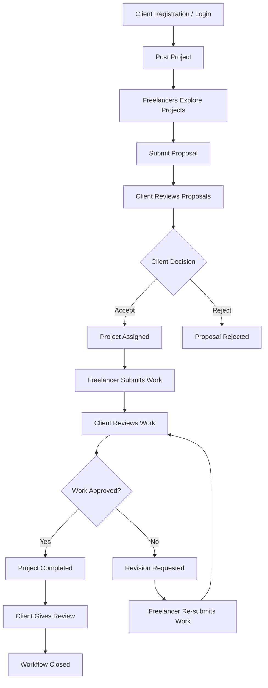
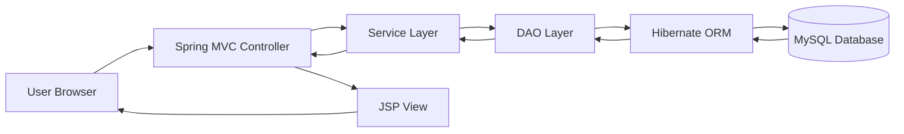

<div align="center">


<br/>


<br/>


<br/>
<br/>


<br/>
<br/>

### A complete freelance marketplace system built with Java, Spring MVC, Hibernate, JSP, MySQL, Maven, and Apache Tomcat.

</div>

---

# WorkSphere

**WorkSphere** is a full-stack freelance marketplace web application designed to connect **clients** and **freelancers** through a structured project-based workflow.

The application follows a real freelance platform flow where clients can post projects, freelancers can submit proposals, clients can accept or reject bids, freelancers can submit work, clients can request revisions, complete projects, and give reviews.

It is inspired by platforms like **Fiverr**, **Upwork**, and **Freelancer**, while being implemented using a traditional Java web development stack.

---

## Table of Contents

- [Overview](#overview)
- [Project Objective](#project-objective)
- [Core Workflow](#core-workflow)
- [Key Features](#key-features)
- [User Roles](#user-roles)
- [Technology Stack](#technology-stack)
- [Architecture](#architecture)
- [Project Modules](#project-modules)
- [Project Structure](#project-structure)
- [Database Setup](#database-setup)
- [Local Setup Guide](#local-setup-guide)
- [Maven Build](#maven-build)
- [Testing Flow](#testing-flow)
- [Security Notes](#security-notes)
- [Roadmap](#roadmap)
- [Author](#author)

---

## Overview

WorkSphere is not a basic CRUD application. It is a workflow-driven marketplace system that includes multiple connected modules such as authentication, project posting, proposal management, bid acceptance, assigned project tracking, work submission, revision handling, reviews, notifications, and custom error pages.

The project is developed using **Spring MVC** for request handling, **Hibernate** for database operations, **JSP/JSTL** for dynamic views, and **MySQL** for persistent storage.

---

## Project Objective

The main objective of WorkSphere is to build a practical freelance marketplace web application where two different user roles can interact through a complete project lifecycle.

The system demonstrates:

```text
Role-based application design
Spring MVC request handling
Hibernate ORM integration
JSP-based dynamic rendering
MySQL database connectivity
Session-based user flow
Project lifecycle management
Proposal and bidding workflow
Work submission and revision flow
Review and notification handling
```

---

## Core Workflow

```text
Client registers or logs in
        ↓
Client posts a project
        ↓
Freelancers explore available projects
        ↓
Freelancers submit proposals
        ↓
Client reviews submitted proposals
        ↓
Client accepts or rejects a proposal
        ↓
Accepted freelancer gets assigned to the project
        ↓
Freelancer submits completed work
        ↓
Client reviews submitted work
        ↓
Client either completes the project or requests revision
        ↓
Freelancer re-submits revised work if required
        ↓
Client completes the project
        ↓
Client gives final review
```

---

## Marketplace Flow Diagram



---

## Key Features

### Client Features

```text
Client registration
Client login
Client dashboard
Post new projects
View posted projects
Edit project details
Cancel projects
View freelancer proposals
Accept freelancer bids
Reject freelancer bids
Track assigned projects
View submitted work
Request revisions
Complete projects
Give freelancer reviews
View client notifications
Mock escrow/payment center flow
```

### Freelancer Features

```text
Freelancer registration
Freelancer login
Freelancer dashboard
Explore available projects
Submit proposals
View submitted proposals
Edit proposals
Withdraw proposals
Track proposal status
View assigned projects
Submit completed work
Re-submit work after revision request
View freelancer notifications
Track project progress
```

### System Features

```text
Role-based authentication
Session-based user flow
Spring MVC controller routing
Hibernate-based database operations
JSP and JSTL dynamic pages
Project lifecycle management
Proposal and bid workflow
Assigned project tracking
Work submission workflow
Revision request workflow
Review and feedback system
Notification pages
File upload support
Custom 404 error page
Custom 403 error page
Custom 500 error page
Maven WAR packaging
Tomcat deployment support
```

---

## User Roles

<table>
<tr>
<td width="50%" valign="top">

<h3>Client</h3>

A client is a user who posts projects and hires freelancers.

Client responsibilities include:

```text
Creating projects
Managing posted projects
Reviewing proposals
Accepting or rejecting bids
Reviewing submitted work
Requesting revisions
Completing projects
Giving reviews
```

</td>
<td width="50%" valign="top">

<h3>Freelancer</h3>

A freelancer is a user who explores projects and submits proposals.

Freelancer responsibilities include:

```text
Exploring available projects
Submitting proposals
Managing proposals
Viewing assigned projects
Submitting completed work
Handling revision requests
Tracking project status
```

</td>
</tr>
</table>

---

## Technology Stack

| Layer | Technology |
|---|---|
| Programming Language | Java |
| Backend Framework | Spring MVC |
| ORM Framework | Hibernate |
| View Layer | JSP, JSTL |
| Frontend | HTML5, CSS3, Bootstrap, JavaScript |
| Database | MySQL |
| Build Tool | Maven |
| Server | Apache Tomcat 9 |
| IDE | Eclipse IDE |
| Packaging | WAR |
| Architecture | MVC |

---

## Architecture

WorkSphere follows the **Model-View-Controller architecture**.

```text
Browser
   ↓
Spring MVC Controller
   ↓
Service Layer
   ↓
DAO Layer
   ↓
Hibernate ORM
   ↓
MySQL Database
   ↓
JSP View Response
```



---

## Project Modules

<details>
<summary><strong>Authentication Module</strong></summary>

Handles login, registration, logout, session management, and role-based navigation.

```text
Client registration
Freelancer registration
Client login
Freelancer login
Logout flow
Session handling
Invalid credential handling
Role-based dashboard redirection
```

</details>

<details>
<summary><strong>Client Module</strong></summary>

Handles all client-side functionality.

```text
Client dashboard
Post project
View posted projects
Edit project
Cancel project
View freelancer proposals
Accept proposal
Reject proposal
Review submitted work
Request revision
Complete project
Give review
Client notifications
```

</details>

<details>
<summary><strong>Freelancer Module</strong></summary>

Handles all freelancer-side functionality.

```text
Freelancer dashboard
Explore projects
Submit proposal
View submitted proposals
Edit proposal
Withdraw proposal
View assigned projects
Submit completed work
Re-submit work after revision
Freelancer notifications
```

</details>

<details>
<summary><strong>Project Module</strong></summary>

Handles the complete project lifecycle.

```text
Create project
Update project
Cancel project
View project details
Track project status
Connect projects with proposals
Connect accepted proposals with assignments
```

</details>

<details>
<summary><strong>Proposal and Bid Module</strong></summary>

Handles freelancer proposals and client bid decisions.

```text
Submit proposal
Edit proposal
Withdraw proposal
View proposal status
Accept proposal
Reject proposal
Update proposal status
Create assigned project after acceptance
```

</details>

<details>
<summary><strong>Work Submission Module</strong></summary>

Handles project work delivery and revision flow.

```text
Submit work
Upload work file
Add submission message
Client reviews submission
Client requests revision
Freelancer re-submits work
Client completes project
```

</details>

<details>
<summary><strong>Review Module</strong></summary>

Handles feedback after successful project completion.

```text
Give review
Store review
Connect review with freelancer
Connect review with project
Display review data
```

</details>

<details>
<summary><strong>Notification Module</strong></summary>

Handles client and freelancer workflow updates.

```text
Client notifications
Freelancer notifications
Bid status updates
Project workflow updates
Revision updates
Completion updates
```

</details>

<details>
<summary><strong>Error Handling Module</strong></summary>

Provides custom error pages instead of default Tomcat screens.

```text
Custom 404 Page Not Found
Custom 403 Forbidden
Custom 500 Internal Server Error
User-friendly error layout
Safe navigation options
Professional platform experience
```

</details>

---

## Important Pages

```text
Landing Page
Client Login
Client Registration
Freelancer Login
Freelancer Registration
Client Dashboard
Freelancer Dashboard
Post Project Page
View My Projects Page
Explore Projects Page
Submit Proposal Page
My Proposals Page
Assigned Projects Page
Submit Work Page
Review Page
Client Notifications Page
Freelancer Notifications Page
Payment / Escrow Page
Custom Error Pages
```

---

## Project Structure

```text
WorkSphere/
│
├── README.md
│
└── WorkSphere/
    │
    ├── src/
    │   └── main/
    │       │
    │       ├── java/
    │       │   └── com/
    │       │       │
    │       │       ├── controller/
    │       │       │   └── Spring MVC Controllers
    │       │       │
    │       │       ├── dao/
    │       │       │   └── Database Access Layer
    │       │       │
    │       │       ├── model/
    │       │       │   └── Hibernate Entity Classes
    │       │       │
    │       │       └── service/
    │       │           └── Business Logic Layer
    │       │
    │       └── webapp/
    │           │
    │           ├── WEB-INF/
    │           │   │
    │           │   ├── View/
    │           │   │   └── JSP Pages
    │           │   │
    │           │   ├── web.xml
    │           │   └── spring-servlet.xml
    │           │
    │           └── Static Web Resources
    │
    ├── pom.xml
    └── .gitignore
```

---

## Database Setup

WorkSphere uses **MySQL** as the database.

Default database name:

```sql
CREATE DATABASE freelance_portal;
```

Database configuration file:

```text
WorkSphere/src/main/webapp/WEB-INF/spring-servlet.xml
```

Example database configuration:

```xml
<property name="url" value="jdbc:mysql://localhost:3306/freelance_portal"/>
<property name="username" value="root"/>
<property name="password" value=""/>
```

Before running the project, make sure:

```text
MySQL Server is running
Database freelance_portal exists
Database username is correct
Database password is correct
Hibernate configuration matches the database
Required database tables are available
```

---

## Local Setup Guide

### 1. Clone Repository

```bash
git clone https://github.com/harshmagar23/WorkSphere.git
```

### 2. Import Project in Eclipse

Open Eclipse and go to:

```text
File → Import → Existing Maven Projects
```

Select this folder:

```text
WorkSphere/WorkSphere
```

Click **Finish**.

### 3. Configure Database

Open:

```text
WorkSphere/src/main/webapp/WEB-INF/spring-servlet.xml
```

Update your local MySQL username and password:

```xml
<property name="username" value="root"/>
<property name="password" value="your_mysql_password"/>
```

### 4. Configure Apache Tomcat

```text
Eclipse → Servers Tab → Add Tomcat 9 → Add WorkSphere Project → Start Server
```

### 5. Run the Application

Open:

```text
http://localhost:8080/WorkSphere/
```

---

## Maven Build

To build the project manually:

```bash
cd WorkSphere
mvn clean package
```

The generated WAR file will be available in:

```text
target/
```

---

## Testing Flow

Use this flow to manually test the complete application:

```text
01. Register as Client
02. Register as Freelancer
03. Login as Client
04. Post a new project
05. View posted project
06. Logout Client
07. Login as Freelancer
08. Explore available projects
09. Submit proposal
10. Edit proposal
11. Logout Freelancer
12. Login as Client
13. View freelancer proposals
14. Accept proposal
15. Logout Client
16. Login as Freelancer
17. View assigned project
18. Submit completed work
19. Logout Freelancer
20. Login as Client
21. Review submitted work
22. Request revision or complete project
23. Login as Freelancer again
24. Re-submit work if revision is requested
25. Login as Client again
26. Complete project
27. Give review
28. Check notifications
```

---

## Demo Scenario

```text
Client:
"I need a responsive portfolio website."

Project:
"Build a Responsive Portfolio Website"

Freelancer:
"I can create a clean, modern, responsive portfolio with strong UI."

Client:
"Proposal accepted."

Freelancer:
"Work submitted with project files."

Client:
"Needs small changes in the hero section."

Freelancer:
"Revised work submitted."

Client:
"Project completed."

Client:
"Review given."
```

---

## Current Project Status

| Feature | Status |
|---|---|
| Client Registration and Login | Complete |
| Freelancer Registration and Login | Complete |
| Client Dashboard | Complete |
| Freelancer Dashboard | Complete |
| Project Posting | Complete |
| Project Editing | Complete |
| Project Cancellation | Complete |
| Project Exploration | Complete |
| Proposal Submission | Complete |
| Proposal Editing | Complete |
| Proposal Withdrawal | Complete |
| Bid Acceptance | Complete |
| Bid Rejection | Complete |
| Assigned Project Tracking | Complete |
| Work Submission | Complete |
| Revision Request | Complete |
| Re-submission | Complete |
| Project Completion | Complete |
| Review System | Complete |
| Notification Pages | Complete |
| Mock Escrow / Payment Flow | Complete |
| Custom Error Pages | Complete |
| Professional JSP UI Theme | Complete |

---

## UI / UX Focus

WorkSphere is designed to feel like a professional freelance marketplace rather than a plain academic web application.

The UI focuses on:

```text
Professional landing experience
Role-based dashboards
Clean navigation
Marketplace-style layout
Readable typography
Consistent theme
Clear status messages
Custom error pages
Smooth user journey
Better workflow visibility
```

---

## GitHub Cleanup

This repository ignores unnecessary local and generated files using `.gitignore`.

Ignored files and folders include:

```text
target/
bin/
.settings/
.classpath
.project
Users/
*.war
*.log
.env
db.properties
mail.properties
application-local.properties
```

This keeps the repository clean from:

```text
Eclipse generated files
Maven build output
Local machine folders
Temporary files
Log files
Secret configuration files
```

---

## Security Notes

This project is currently configured for local development.

For production deployment:

```text
Never hardcode database passwords
Never hardcode email credentials
Never commit API keys
Use environment variables
Use external configuration files
Use HTTPS
Validate user input
Restrict uploaded file types
Protect private routes
Use secure session handling
Rotate exposed credentials immediately
```

---

## Screenshots

Screenshots can be added later in a `screenshots/` folder.

Recommended screenshots:

```text
Landing Page
Client Login
Freelancer Login
Client Dashboard
Freelancer Dashboard
Post Project Page
Explore Projects Page
Proposal Page
Assigned Project Page
Submit Work Page
Review Page
Notification Page
Custom Error Page
```

Example:

```markdown


```

---

## Roadmap

Planned future improvements:

```text
Real-time chat between client and freelancer
Admin dashboard
Advanced project search
Advanced project filtering
Freelancer portfolio page
Client profile page
Saved projects
Email notification system
Real payment gateway integration
Cloud deployment
REST API version
Mobile-first responsive improvements
Analytics dashboard
Project recommendation system
Freelancer rating filter
Project category filter
File preview system
Admin user management
```

---

## Learning Outcomes

This project demonstrates:

```text
Java web application development
Spring MVC request handling
Hibernate ORM integration
MySQL database operations
JSP and JSTL dynamic rendering
Maven dependency management
Apache Tomcat deployment
Role-based workflow design
Session-based authentication
File upload handling
Custom error page configuration
Git and GitHub repository management
Full-stack debugging process
```

---

## Author

```text
Harsh Magar
Final Year B.Tech Computer Science Student
Full Stack Java Web Application Developer
```

---

## Repository

```text
https://github.com/harshmagar23/WorkSphere
```

---

## License

This project is created for academic learning, portfolio presentation, and full-stack Java web development practice.

---

<div align="center">


<br/>
<br/>


<br/>
<br/>


</div>
